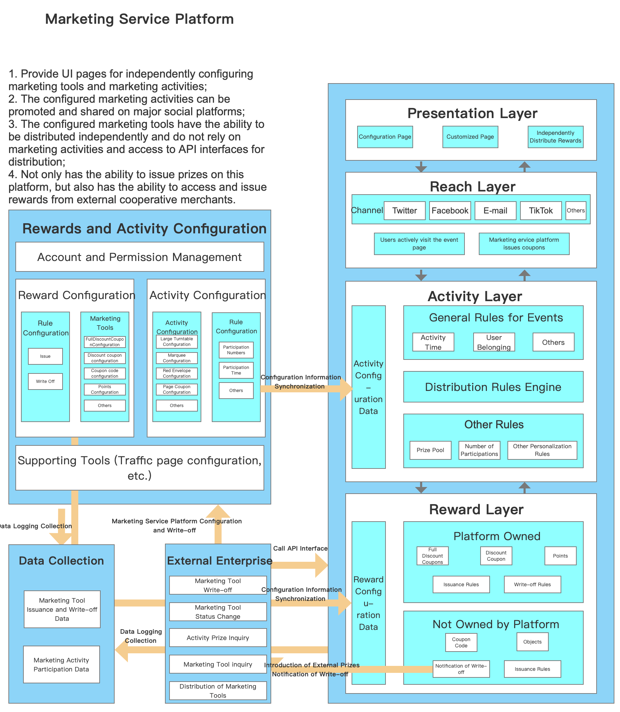
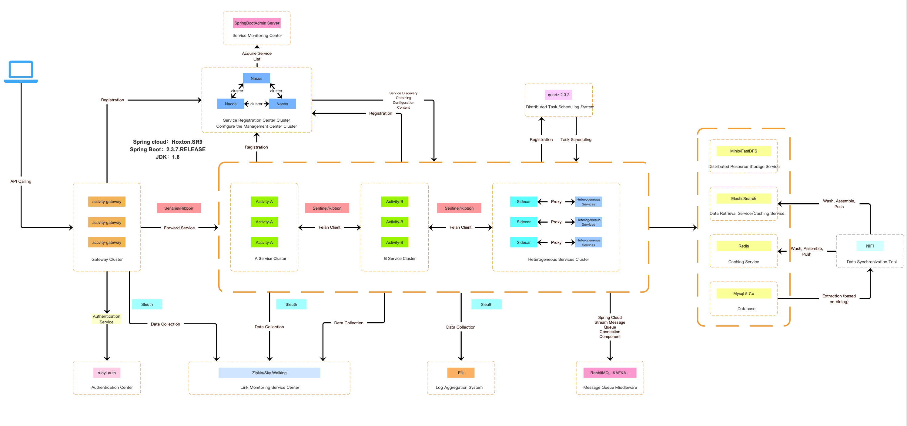

# Marketing Services Platform Introduction

## 1. About Marketing Services Platform

### 1.1 Introduction
The marketing service platform is committed to providing overseas small, medium and micro enterprises with the ability to independently carry out marketing activities. It is an artifact for enterprises to promote user activity, expand external traffic, grow new users, and enhance brand exposure.
This platform enables companies to carry out marketing activities and provide full-process supporting services. From independently configuring marketing resources such as coupons, points and coupon codes, to distributing marketing resources to launch personalized activities, to supporting write-off capabilities and data statistical analysis, the basic functions are practical and comprehensive. Externally, it supports the sharing and drainage of major social traffic platforms such as Twitter, Facebook, and Tiktok. It also supports API interface access to write-offs and marketing service platforms to actively write off. It is suitable for the development of all corporate marketing activities, strengthens the company's marketing capabilities, and helps companies achieve considerable user and transaction volume growth.

### 1.2 Capabilities

The marketing service platform mainly has three major module functions: marketing tools, marketing activities, data analysis and management. The marketing tools include the following four types:
- **Coupons**: For direct reduction, full reduction, and free order activities.
- **Discount Vouchers**: For discounts, flash sales, and promotions.
- **Points**: To retain old customers and convert new customers into loyal ones.
- **Coupon Codes**: Integrating external resources to attract new and existing customers.

Based on the above marketing tools, supporting marketing activities are developed to increase the channels for marketing tools to reach users:
- **Big carousel activity**
- **Marquee activities**
- **Red envelope opening activity**
- **On-page coupon collection activity**

In addition, the marketing service platform also has data and analysis capabilities about marketing tools and marketing activities. It can query the overall situation and detailed data of marketing tools and marketing activities, making it easier for users to analyze the effects of activities and make more accurate marketing decision making.
Detailed function list of marketing service platform:
https://docs.qq.com/sheet/DYkVLalJ0UERoeEdN?tab=BB08J2

### 1.3 Advantages
The marketing service platform is designed to serve all enterprises in need of marketing capabilities, manage marketing assets in an all-round way for enterprises, develop rich and diverse marketing models, improve marketing efficiency, and enhance corporate marketing capabilities. It has omni-channel customer acquisition, potential customer management, and customer activities. Full-process marketing service capabilities of data analysis.
In addition, the marketing service platform provides the issuance and write-off capabilities of a variety of marketing tools, supports online coupon issuance and offline coupon code write-off, supports enterprises to call API interfaces for marketing tool write-offs, and uses the marketing service platform to proactively conduct Write-off is not only applicable to online businesses, but also to offline businesses, reducing the limitations of companies' use of marketing capabilities.
Enterprises accessing this marketing service platform and using the marketing capabilities provided by the platform can bring many benefits to the enterprise:
- **Improve marketing efficiency**
  The marketing service platform provides independent configuration capabilities, which can quickly configure marketing tools such as discount coupons, discount coupons, points and coupon codes, as well as lottery and coupon marketing activities, through supporting automated marketing Process, companies can perform marketing tasks more quickly, reduce manual intervention, and further improve marketing effectiveness while improving corporate marketing efficiency.
- **Increase sales opportunities**
  The marketing service platform has the ability to share activities to major social platforms such as Twitter, Facebook, and Tiktok. By advertising on major social media, companies can promote products to a wider range of target customer groups. , attract more potential customers. At the same time, the marketing service platform also has comprehensive data analysis capabilities. Through data analysis tools to analyze users' use of marketing tools and participation in activities, companies can better understand customer needs and purchasing behaviors, and provide customized sales for different customer groups. program to help companies increase sales opportunities.
- **Enhance customer experience**
  Excellent marketing tools can enhance customer experience and make customers feel the care and value of the company. Our marketing service platform provides multiple types of marketing tools and the configuration of multiple marketing activity page themes. Through personalized marketing activities, companies can provide customers with customized content to meet customer needs and interests.
- **Increase brand awareness**
  By using this marketing service platform, companies can increase brand awareness and expand brand influence. By configuring fixed activities such as holidays and membership days through the marketing service platform, promoting and publishing on major social media platforms, and interacting closely with customers, companies can increase their own brand exposure and word-of-mouth effects.
- **Increase market competitiveness**
  Through the data analysis tools and automated marketing processes of the marketing service platform, companies can better understand market demand and competition, formulate more precise marketing strategies and plans, and respond to corporate marketing demands in a timely manner. Iterate and optimize existing capabilities to help companies improve market share and competitiveness.
- **Reduce customer acquisition costs**
  The marketing service platform will conduct data analysis and precipitation on the use of marketing tools and participation in marketing activities. Through the data analysis tools provided by the platform, companies can find target customer groups more quickly and improve marketing Effectiveness and conversion rate, thereby reducing the cost of corporate marketing customer acquisition.

### 1.4 Visions
The marketing service platform is committed to enriching its own marketing capabilities, providing more marketing methods, and improving data statistics and analysis capabilities. Let each connected enterprise find a marketing method suitable for its own enterprise through the marketing service platform, improve the enterprise's marketing capabilities, acquire more users more quickly and effectively through marketing, and better reach users with its own brand image.

## 2. About the Project
### 2.1 Online Experience
Online experience address: https://vh3anq.axshare.com

### 2.2 System architecture

Activity architecture is a comprehensive microservice architecture. The overall system architecture is as follows:

### 2.3 Technical Stack
This project is based on the RuoYi-Cloud backend development framework, thanks to RuoYi-Cloud for its open source.
- **Front-end technology stack**
  ES6, Vue, Vuex, Vue-router, Vue-cli, Axios, Element-ui;
- **Back-end technology stack**
  Spring Boot, Spring Cloud & Alibaba, Nacos, Mybatis-plus, xxljob, RabbitMQ, Forest;

### 2.4 Project Structure

#### Backend Structure
- `activity-api` - System business interface module
- `activity-auth` - Module for role, permission, department, user authentication, etc.
- `activity-common` - Common components module
- `activity-fileservice` - File service module
- `activity-framework` - Framework configuration
- `activity-gateway` - Gateway service
- `activity-scheduler` - Module related to scheduled tasks
- `activity-service` - System service layer extraction, interaction with the database
- `activity-achieve` - Activity interface implementation

#### Frontend Structure
- `activity-pc` - Backend project
- `activity-mobile` - Mobile project including mobile workbench, task treasure, group fission, and other H5 applications

### 2.5 Project Deployment
#### 2.5.1 Recommended Minimum Server Configuration
| Type      | Configuration |
|-----------|---------------|
| OS        | CentOS 8.2    |
| CPU       | 4 Cores       |
| Memory    | 16G           |
| Bandwidth | 5M            |
| Disk      | 100G          |

#### 2.5.2 Environment Preparation
Before deploying the project, it is assumed that you have installed and are in possession of the environments that the project depends on. For specific installation instructions, you can refer to searches on Baidu:
- JDK >= 1.8 (Version 1.8 recommended)
- MySQL >= 5.7.0 (Version 5.7.18 recommended)
- Redis >= 3.0
- Nginx >= 1.18.0
- Nacos >= 1.4.0
- Node >= 10
- xxl-job >= 2.3.1
- RabbitMQ >= 3.8 (Version 3.8.6 recommended)

#### 2.5.3 Domain Names and HTTPS Certificates
- The domain name should be registered on the same platform as the server, and the entity for which the domain is registered should be the same entity that is using the enterprise.
- Purchase link (Tencent Cloud recommended): [https://dnspod.cloud.tencent.com/](https://dnspod.cloud.tencent.com/)

## 3. Contact Us
hisun_aiteam@outlook.com
